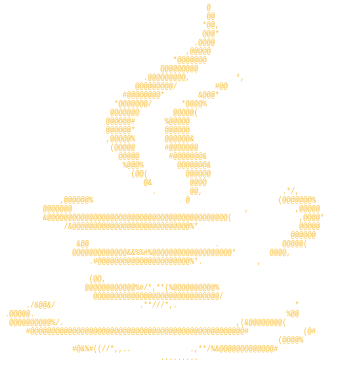

<div align="center">

```
╔════════════════════════════════════════════════════════════╗
║  C:\USERS\NICOLAS>_                                        ║
║  BOOTING PROFILE.EXE...                            [ OK ]  ║
╚════════════════════════════════════════════════════════════╝
```


<br>



</div>

<br>

<div align="center">

### `> ./USER.EXE`

</div>

<table align="center" width="100%" >
<tr>
<td>

```
┌────────────────────────────────────────────────────────────┐
│ USER.EXE                                          [-][□][X]│
├────────────────────────────────────────────────────────────┤
│                                                            │
│  NOME .......... Nicolas Miguel Neves                      │
│  NACIONALIDADE . Brasileiro                                │
│  IDIOMA ........ Ingles [B2] ████████░░                    │
│  FORMACAO ...... Tecnico em Desenvolvimento de Sistemas    │
│                   Senai Centro 4.0                         │
│                                                            │    
└────────────────────────────────────────────────────────────┘
```

</td>
</tr>
</table>

> **robótica** e **JAVA**. Construo aplicações desktop, web e sistemas de IA enquanto programo robôs de competição em **FRC** e projetos com **Arduino**. Sempre com o terminal aberto e um café (Java, claro) do lado.

<br>

<div align="center" >

### `> ./AREAS_DE_ATUACAO.EXE`

</div>

<div align="center">


</div>

<br>

<div align="center">

### `> ./SKILLS.EXE`

</div>

<table align="center" width="100%">
<tr>
<td>

```
┌────────────────────────────────────────────────────────────┐
│ SKILLS.EXE — LINGUAGENS & TECNOLOGIAS             [_][□][X]│
├────────────────────────────────────────────────────────────┤
```

<div align="center">


<br>


</div>

```
├────────────────────────────────────────────────────────────┤
│ IDES & FERRAMENTAS                                         │
├────────────────────────────────────────────────────────────┤
```

<div align="center">


</div>

</td>
</tr>
</table>

<br>

<div align="center">

### `> ./CONTACT.EXE`

</div>

<table align="center" width="100%">
<tr>
<td>

```
┌─────────────────────────────────────────────────────────────┐
│ CONTACT.EXE                                        [-][□][X]│
├─────────────────────────────────────────────────────────────┤
│  E-mail : nicolas.mnesves@gmail.com                         │
│  >> conectando ao servidor...                     [ OK ]    │
│                                                             │
└─────────────────────────────────────────────────────────────┘
```

<div align="center">

[](https://github.com/nicolasmnesves-sudo)

</div>

</td>
</tr>
</table>

<br>

<div align="center">

```
> C:\USERS\NICOLAS> _
  Obrigado pela visita! Compilando o proximo projeto...
```


</div>
